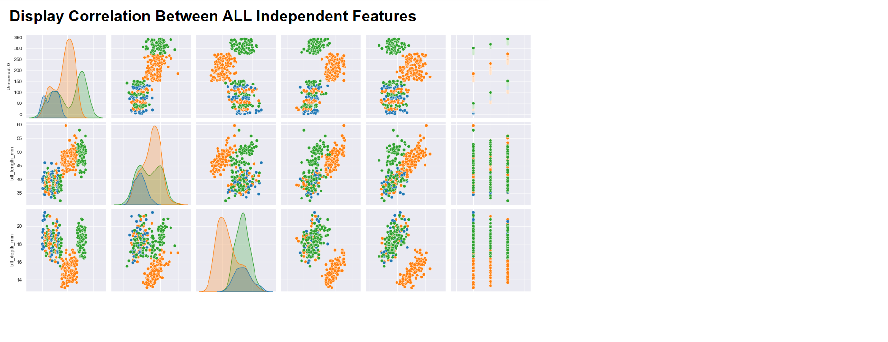

# Data Profiling - Tells you **EVERYTHING** about your data. Descriptive statistics allows you to easily discover any issues in your data
Tells you **EVERYTHING** about your data. Descriptive statistics allows you to easily discover any issues in your data

## Streamlining Data Quality with Data Profiling Solutions
Ensuring data quality is paramount in any data-driven organization. A **data profiling solution** offers a robust method for assessing and improving the quality of data sets.

Designed to work on any data sample, this solution performs comprehensive descriptive statistics as well as completeness and consistency analysis. By evaluating every column for anomalies and redundant data, the data profiling solution helps identify issues at the point of entry, akin to "barbarians at the gate," and allows enterprises to proactively address data quality problems.

## Who Can Use Data Profiling Solutions?

1. **Data Analysts**: Analysts can leverage this tool to quickly identify and address data quality issues, reducing the time spent on manual data cleaning and preparation.
2. **Data Engineers**: Engineers responsible for data pipeline management can use profiling to ensure data integrity before it flows into downstream systems, thereby maintaining high standards of data quality.
3. **Business Intelligence Professionals**: BI professionals can use data profiling to ensure the accuracy and reliability of data used in reporting and analytics, leading to more trustworthy insights.

## Advantages of Using Data Profiling Solutions
1. **Time Savings**: Automated data profiling significantly reduces the time analysts spend on identifying and rectifying data quality issues. This allows them to focus on more strategic tasks, accelerating project timelines.
2. **Enhanced Data Quality**: By identifying anomalies and redundant data at the point of entry, organizations can proactively manage data quality, preventing bad data from contaminating databases and analytic systems.
3. **Improved Decision Making**: High-quality data leads to more accurate analysis and reporting, enabling better-informed decisions across the enterprise.
4. **Cost Savings**: Proactive data quality management reduces the costs associated with downstream data cleaning and remediation efforts, providing a substantial return on investment.

## Return on Investment (ROI)
The implementation of a data profiling solution can lead to significant ROI for enterprises. By automating the detection of data quality issues, businesses can save on labor costs and reduce the time to actionable insights. Moreover, the prevention of bad data from entering systems enhances overall data reliability and supports better business outcomes.

## Conclusion
In conclusion, a data profiling solution is an essential tool for maintaining high data quality standards. It benefits a wide range of users, from analysts to BI professionals, by automating the detection and remediation of data issues, leading to time savings, cost efficiency, and improved decision-making capabilities.

## Background (for NERDS like me :) 

**Data profiling** is crucial for comprehending the structure and quality of a dataset, helping analysts identify anomalies and inconsistencies that may affect analysis outcomes. By systematically examining variables, data types, and distributions, data profiling lays the groundwork for effective data cleaning, preprocessing, and modeling, ensuring accurate and reliable insights are derived. 

**Descriptive statistics** serve as a fundamental tool for data scientists to comprehend the characteristics of their datasets, enabling them to uncover patterns and trends. By summarizing key features such as central tendency and variability, descriptive statistics offer concise insights into the distribution of data, facilitating informed decision-making and hypothesis testing. Ultimately, their utilization empowers data scientists to extract meaningful interpretations and communicate findings effectively to stakeholders, driving informed actions and solutions.

**Descriptive statistics** involve methods for summarizing and describing the main features of a dataset. This includes measures such as mean, median, and mode for central tendency, as well as measures like standard deviation and range for dispersion or spread. These statistics offer insights into the distribution, variability, and characteristics of the data, aiding in understanding and interpreting its underlying patterns and trends.

## Getting Started
To get started with the **Data Profiling** solution repository, follow these steps:
1. Clone the repository to your local machine.
2. Install the required dependencies listed at the top of the notebook.
3. Explore the example code provided in the repository and experiment.
4. Run the notebook and make it your own - **EASY !**
    
## Solution Features
- Easy to understand and use  
- Easily Configurable 
- Quickly start your project with pre-built templates
- Its Fast and Automated

## Notebook Features
- **Self Documenting** - Automatically identifes major steps in notebook 
- **Self Testing** - Unit Testing for each function
- **Easily Configurable** - Easily modify with **config.INI** - keyname value pairs
- **Includes Talking Code** - The code explains itself 
- **Self Logging** - Enhanced python standard logging   
- **Self Debugging** - Enhanced python standard debugging
- **Low Code** - or - No Code  - Most solutions are under 50 lines of code
- **Educational** - Includes educational dialogue and background material
- **Secure** - All the sample solutions are secure and use synthetic data, ensuring they contain no sensitive data or information.
    
## Deliverables or Figures
                   
    

## Github    
## https://github.com/JoeEberle/ 

## Email 
## josepheberle@outlook.com 

    

    