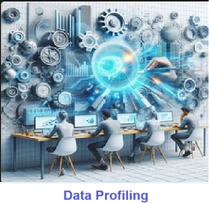
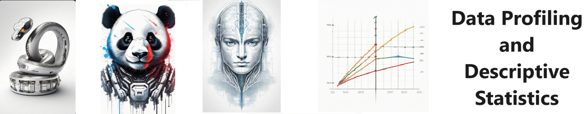
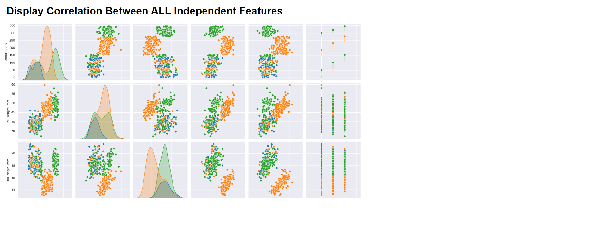
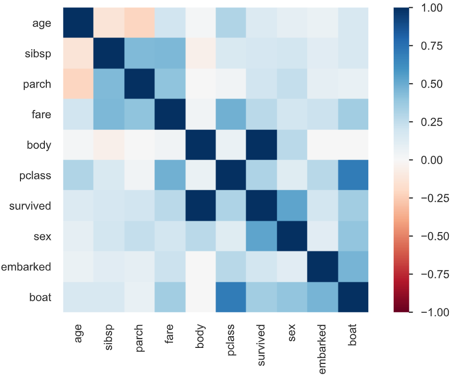
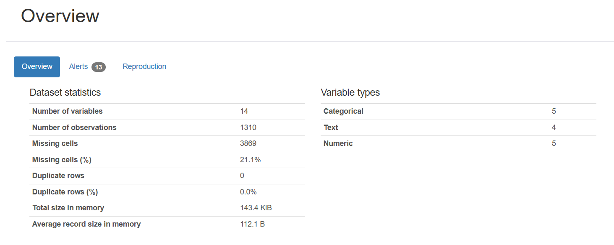
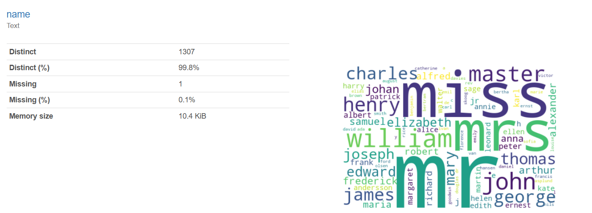

# Design Goal - Data profiling provides descriptive statistics for **ANY** data
Data profiling provides descriptive statistics for **ANY** data

**Data profiling** is crucial for comprehending the structure and quality of a dataset, helping analysts identify anomalies and inconsistencies that may affect analysis outcomes. By systematically examining variables, data types, and distributions, data profiling lays the groundwork for effective data cleaning, preprocessing, and modeling, ensuring accurate and reliable insights are derived. 

**Descriptive statistics** serve as a fundamental tool for data scientists to comprehend the characteristics of their datasets, enabling them to uncover patterns and trends. By summarizing key features such as central tendency and variability, descriptive statistics offer concise insights into the distribution of data, facilitating informed decision-making and hypothesis testing. Ultimately, their utilization empowers data scientists to extract meaningful interpretations and communicate findings effectively to stakeholders, driving informed actions and solutions.

**Descriptive statistics** involve methods for summarizing and describing the main features of a dataset. This includes measures such as mean, median, and mode for central tendency, as well as measures like standard deviation and range for dispersion or spread. These statistics offer insights into the distribution, variability, and characteristics of the data, aiding in understanding and interpreting its underlying patterns and trends.

## Features
- Easy to understand and use  
- Easily Configurable 
- Quickly start your project with pre-built templates
- Its Fast and Automated

## Notebook Features
- **Self Documenting** - Automatically identifes major steps in notebook 
- **Self Testing** - Unit Testing for each ptyhon function
- **Easily Configurable** -easily modifyable with config.INI name value pairs
- **Includes Talking Code** - The code explains itself.
- **Self Logging** - enhanced python standard logging   
- **Self Debugging** - enhanced python standard debugging
- **Low Code - or - No Code** - Most solutions are under 50 lines of code
- **Educational** - Includes educational dialogue and background material
    
## Getting Started
To get started with the **Design Goal** solution repository, follow these steps:
1. Clone the repository to your local machine.
2. Install the required dependencies listed at the top of the notebook.
3. Explore the example code provided in the repository and experiment.
4. Run the notebook and make it your own - **EASY !**
    
## https://github.com/JoeEberle/ -- josepheberle@outlook.com 
    

                   